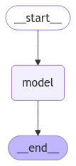

# Gita-GPT:

**Gita  GPT** is a conversational  agent built to help users interact with LLM answering just like the way ***Bhagwan SHRI KRISHNA*** has interacted with *Arjun*.
<Image><center>
</center>
</Image>


## Workflow:
* Intially the english version of ***Bhagavadgita*** was taken and with the text and metadata was properly extarcted PAGE wise with thhe help of **PyPDF2**

* Now the extracted text is embedded and stored into sqlite database using **chromadb** and its default embedding funciton **all-minilm-l6-v2**

* The code for proper text extraction is at [extract.py](extract.py). 


* Now, after creating a knowledge base we shall usse the retieval functionality provided by the **chromadb** library.

```python
pages= []
data=[]
ids = []
load_dotenv()
#ChromDB Client intialization
client = chromadb.PersistentClient(path='data')

reader = PdfReader("Bhagavad-gita_ english.pdf")

 def extract_raw_text():
     for i in range(42,1030):
         page = reader.pages[i]
         pages.append({  
             'pno': i,
         })
         data.append(page.extract_text())
         ids.append(f'pg-{i}')
 extract_raw_text()

 if len(data)!= 0:
         collection.add(
         documents=data,
         metadatas=pages,
         ids = ids
     )
```

**But the above part of  the code is commented out  as to not initiate the extraction function whenever the context is retrieved since the *chromadb* client is exported to [context.py](context.py)**

```python
from dotenv import load_dotenv
from extract import client
load_dotenv()

collection  = client.get_collection('mygita')
```

* The code for context retreival along with the metadata required for this **RAG** pipeline is present at [context.py](context.py)


```python
def context_retreival(query: str):
    results = collection.query(
        query_texts=[query],
        n_results=5
    )
    final_list=[]
    [documents] = results['documents']
    [metadatas] = results['metadatas']
    for i in range(len(documents)):
        final_list.append({f'document_{i}':
            {'document':documents[i],
            'metadata': metadatas[i]}
        })
    return str(final_list)
```
* The conversation agent is entirely built using **langchain and langraph**

<Image><center>
</center>
</Image>

* This is the graph of the workflow and  coming to the architecture of conversation flow, the entire interaction is based out of memory using **persistent DB architecture**. In the backend messages are managed using **SQLite** or **Postgres**

***You can study more about adding prompt templates and managing hisstory for a conversational flow refering to these links  :***

1. [Building a chatbot](https://python.langchain.com/docs/tutorials/chatbot/) : Refer through Message Persistencce and Prompt Templates
2. [Persistence](https://langchain-ai.github.io/langgraph/concepts/persistence/#values): Understanding the concepts of persistence like thread ids, checkpoints, memory store etc.
```python
{"configurable": {"thread_id": "1"}}
```

* This particcular funcctionality is present at [graph.py](graph.py)

* And finally a simple api route has been built using **FastAPI** refer to [llm.py](llm.py)
```python
@app.get("/")
def send_response(conversation_id: str,query:str):
    config = {"configurable": {"thread_id": f"{conversation_id}"}}
    input_messages = [HumanMessage(query)]
    context =  context_retreival(query=query)
    output = flow.invoke(input={"messages": input_messages,"context":context },config=config)
    return output["messages"][-1]
```
## Implementation
* Create an env file and make sure you provide a groq api key like
>GROQ_API_KEY='your_api_key'
* 
## Libraries used

1. ***chromadb***
2. ***fastapi***
3. ***langchain***
4. ***langchain-groq***
5. ***langgraph***
6. ***PyPDF2***
## Implementation

1. Clone the repo:
> git clone 'URL'

2. If you want create a venv in your vscode selecting the python version after that activate using
>.venv/Scripts/activate

3. Now you can install the necessary libraries using
> pip install requirements.txt

4. To run the server
> fastapi dev llm.py

5. Go to [Docs](http://localhost:8000/docs) of the server hosted at 8000 or add ***/docs*** at the end of the server url

6. Read the doc and try out the route to get a response

## USP
* Each unique thread id can be unique catering multiple threads for multiple users

## Demo
<div style="position: relative; padding-bottom: 56.25%; height: 0;"><iframe src="https://www.loom.com/embed/f5a55ed1631546aaaba0c7af9e3c1d5a?sid=9deca8af-eef9-409c-afb8-7b00684ddcab" frameborder="0" webkitallowfullscreen mozallowfullscreen allowfullscreen style="position: absolute; top: 0; left: 0; width: 100%; height: 100%;"></iframe></div>
